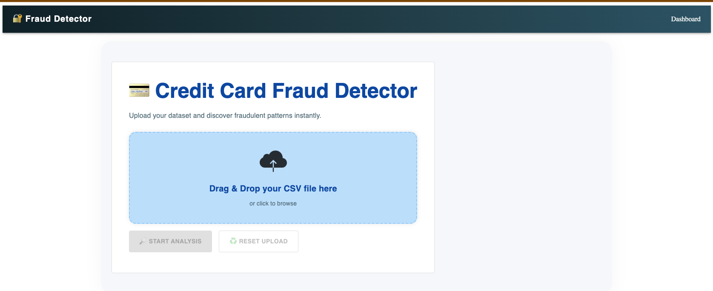
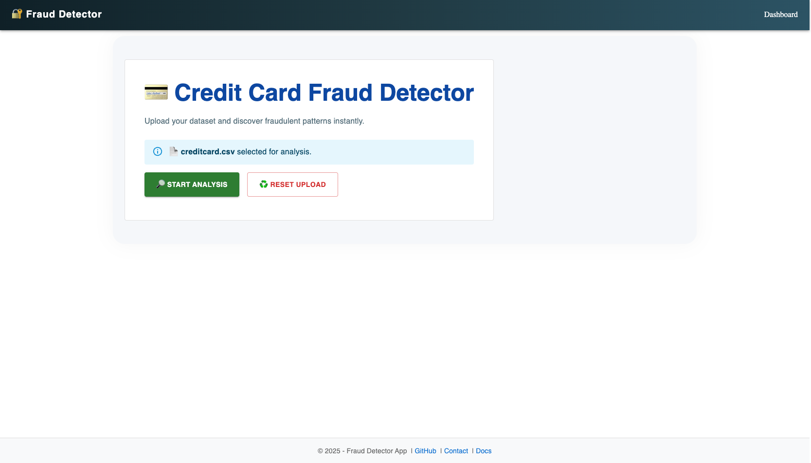
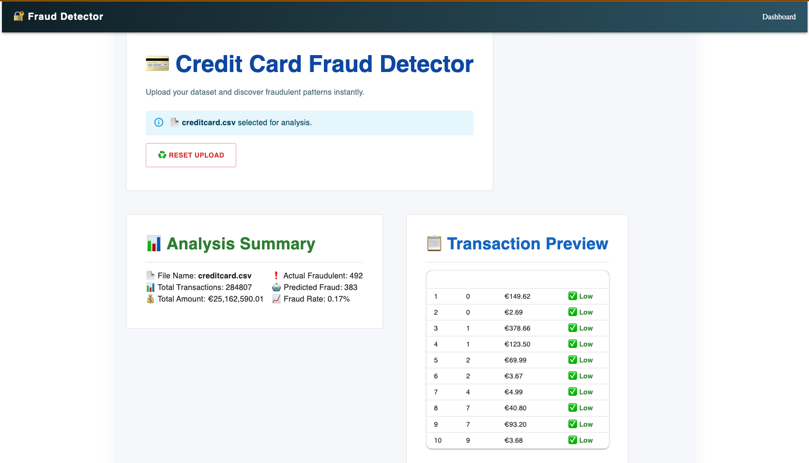

# 🛡️ Fraud Detector – Kreditkartenbetrugserkennung

## 📌 Projektüberblick

Dieses Projekt ist ein intelligentes System zur Erkennung von Kreditkartenbetrug mithilfe von Machine Learning, pandas und Visualisierungstools wie Matplotlib und Plotly. Die Benutzeroberfläche basiert auf React + Material UI, während der Backend-Server auf Flask mit SQLite-Datenbank läuft.

## 🎯 Features

- CSV-Upload und automatische Analyse
- Anzeige von Statistiken (Anzahl Transaktionen, Betrugsrate, Gesamtbetrag)
- Vorschau von verdächtigen Transaktionen
- Training eines Random Forest-Modells zur Vorhersage betrügerischer Aktivitäten
- Responsives Dashboard mit professionellem UI

## 🧠 Technischer Stack

- Python 3.12, Flask, pandas, NumPy, scikit-learn
- Matplotlib, Seaborn, Plotly
- SQLite als Datenbank
- Frontend mit React, Material UI (MUI), Vite

## 🧱 Projektstruktur

```
Abschlussprojekt/
│
├── app.py                  # Flask-Backend mit API-Endpunkten
├── db/                     # SQLite-Datenbank
├── model/                  # Modellklassen & Modelltraining
├── notebooks/              # Jupyter Notebooks für EDA & Modelltraining
├── screenshots/            # Beispiel-Screenshots der Benutzeroberfläche
├── fraud-detection/        # Frontend-Quellcode (React + MUI)
├── requirements.txt        # Abhängigkeiten
└── README.md               # Diese Datei
```

## 🧪 Beispiel-Screenshots

Im Folgenden werden drei typische Anwendungsbilder dargestellt, die den Ablauf der Betrugserkennung illustrieren:

1. **Startseite & Dashboard**  
   Die moderne Benutzeroberfläche zeigt eine klare Struktur zum CSV-Upload und eine intuitive Analyseübersicht mit Diagrammen.  
   

2. **Erfolgreicher Datei-Upload**  
   Nach dem Hochladen einer CSV-Datei sieht der Nutzer eine Bestätigung sowie die Option, die Analyse manuell mit einem Klick auf **"Start Analysis"** zu starten. Danach wird eine detaillierte Zusammenfassung der geladenen Transaktionen angezeigt.  
   

3. **Analyse-Ergebnisse mit Risikoeinschätzung**  
   Die analysierten Transaktionen werden visuell dargestellt – inklusive Betrugsrate, vorhergesagten Betrugsfällen und einer Tabelle mit Risikoeinstufung.  
   

## ⚙️ Installation

```bash
# Backend
pip install -r requirements.txt
python init_db.py
python app.py

# Frontend
cd fraud-detection
npm install
npm run dev
```

## 🚀 Anwendung

1. Starte das Backend unter http://127.0.0.1:5000
2. Starte das Frontend unter http://localhost:5173
3. Lade eine CSV-Datei hoch und beginne die Analyse

## 👤 Autor

Quoc Viet Phung – Python Developer & AI Enthusiast